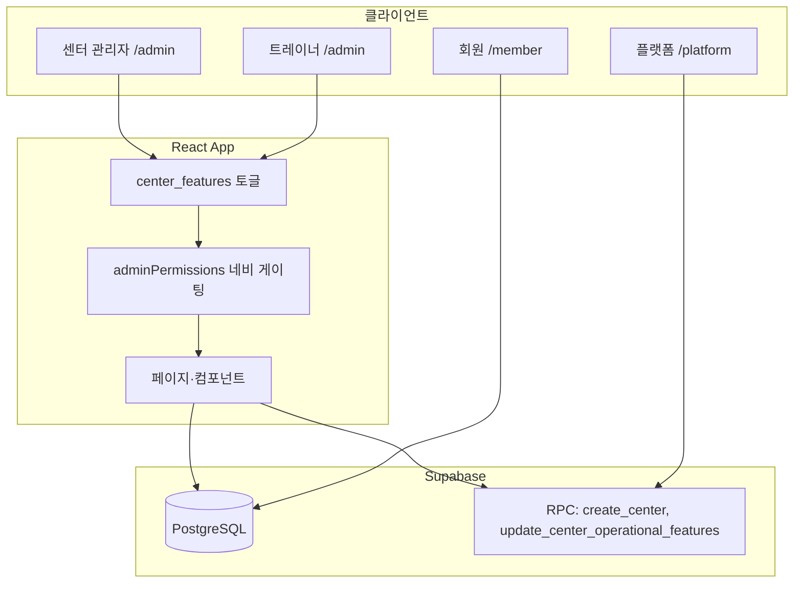

# MotionHub (mobel-performance-admin) 구현 현황 요약

> 작성일: 2026-06-05  
> 프로젝트 경로: `C:\Users\kjh56\Projects\mobel-performance-admin`  
> 저장소: `geulhan/MOVEL.git` · 프로덕션: [motionhub.kr](https://motionhub.kr) (Vercel 자동 배포)

---

## 1. 프로젝트 개요

React + TypeScript + Vite + Supabase 기반의 **피트니스 센터 운영 SaaS**입니다.  
단일 PT 센터 관리에서 출발해 **멀티센터 · 플랫폼 관리 · 필라테스/요가/GX · 시설 운영**까지 확장 중입니다.

| 구분 | 기술 |
|------|------|
| 프론트엔드 | React 18, React Router, Tailwind CSS |
| 백엔드/DB | Supabase (PostgreSQL, RLS, RPC) |
| 배포 | Vercel |
| 도메인 | motionhub.kr |

---

## 2. 사용자 역할

| 역할 | 접근 경로 | 주요 권한 |
|------|-----------|-----------|
| **플랫폼 관리자** | `/platform` | 센터 생성·베타 신청·동의 관리 |
| **센터 관리자** | `/admin` | 센터 전체 운영 |
| **트레이너** | `/admin` (제한) | 담당 회원·스케줄·출석·클래스 |
| **회원** | `/member` | 결제 요청·계약 서명·예약 등 |

---

## 3. 센터 관리자 메뉴 구조

기능 토글(`center_features`)에 따라 메뉴가 **동적으로 표시/숨김**됩니다.

| 메뉴 | 경로 | 기능 키 | 비고 |
|------|------|---------|------|
| 대시보드 | `/admin` | — | 관리자 전용 (트레이너는 회원 관리로 리다이렉트) |
| 회원 관리 | `/admin/members` | `membership` | 트레이너 접근 가능 |
| PT 스케줄 | `/admin/schedule` | `pt` | |
| 클래스 | `/admin/classes` | `class` / `pilates` / `yoga` / `gx` | 그룹수업 |
| 출석부 | `/admin/attendance` | `attendance` | 트레이너 스코프 지원 |
| 트레이너 | `/admin/trainers` | `pt` 또는 클래스 | |
| 시설 운영 | `/admin/facility` | `facility` / `locker` / `towel` | 입장·락커·수건 |
| 마일리지 관리 | `/admin/rewards` | `mileage` | |
| 결제 관리 | `/admin/payments` | `membership` | |
| 경영분석 | `/admin/analytics` | — | |
| 메시지 발송 | `/admin/messages` | `notifications` | |
| 센터 설정 | `/admin/settings` | — | 기능 관리·브랜딩 등 |

### 회원 상세 탭

`/admin/member/:memberId` 하위:

- 개요 · PT/결제 · 출석 · 운동기록 · 인바디 · 운동일지

---

## 4. MotionHub SaaS 확장 (migration 069)

**커밋:** `9d17cce` — *Expand MotionHub SaaS with feature toggles, classes, and facility ops*

### 4.1 센터 운영 유형 (`operational_type`)

| 유형 | 설명 |
|------|------|
| `pt` | 1:1 PT 중심 |
| `pilates` | 필라테스 스튜디오 |
| `yoga` | 요가 스튜디오 |
| `gym` | 헬스장 (시설·락커·수건) |
| `hybrid` | 복합 센터 (전 기능) |

센터 생성 시 유형 선택 → `apply_operational_features` RPC로 `center_features` 기본값 자동 적용.

### 4.2 운영 기능 토글 (`center_features`)

**운영 기능:** membership, pt, facility, locker, towel, class, pilates, yoga, gx, attendance, exercise_log  
**부가 기능:** mileage, contracts, notifications

- UI: **센터 설정 → 기능 관리** (`CenterFeatureManagementPanel`)
- API: `src/api/centerFeatures.ts`, `update_center_operational_features` RPC
- 네비게이션 게이팅: `src/lib/adminPermissions.ts`, `AdminAccessGuard`, `AdminLayout`

### 4.3 그룹수업 (Classes)

**DB 테이블:** `classes`, `class_schedules`, `class_reservations`, `class_attendance`, `member_session_passes`

| 기능 | 설명 |
|------|------|
| 클래스 등록 | 필라테스·요가·GX·소그룹 PT 유형, 정원·시간·회차 차감 설정 |
| 주간 시간표 | 일정 생성·주간 이동 |
| 예약 관리 | 회원 검색 후 예약, 대기 목록 |
| 출석 처리 | 출석 / 노쇼 / 취소 + 회차권 차감 |
| 회원 앱 | `MemberClassBookingSection` — 회원 측 예약 |

**관리 UI:** `src/pages/admin/ClassesPage.tsx`  
**API:** `src/api/classes.ts`

### 4.4 시설 운영 (Facility Ops)

**DB 테이블:** `locker_assignments`, `towel_rentals`, `facility_checkins`

| 기능 | 설명 |
|------|------|
| 빠른 입장 체크인 | 회원 검색 콤보박스로 즉시 체크인 |
| 락커 배정 | 번호·기간·회원 연결 |
| 수건 대여/반납 | 대여 상태 추적 |
| KPI | 활성 락커·만료 임박·대여 수건·당일 입장 수 |

**관리 UI:** `src/pages/admin/FacilityOpsPage.tsx`  
**API:** `src/api/facilityOps.ts`

### 4.5 대시보드 KPI 확장

- `ClassDashboardKpi` — 클래스·예약 관련 지표
- `OperationalKpiSidebar` — 시설·운영 사이드바 KPI

---

## 5. 클래스·시설 UX 개선 (커밋 b446c41)

**커밋:** `b446c41` — *Simplify class schedule and facility check-in UX*

| 영역 | 개선 내용 |
|------|-----------|
| 클래스 페이지 | 복잡한 캘린더 → **주간 아젠다 리스트 + 우측 상세 패널** |
| 출석 버튼 | 출석 / 노쇼 / 취소 **대형 버튼**으로 단순화 |
| 회원 검색 | `MemberSearchCombobox` 공통 컴포넌트 |
| 시설 운영 | 상단 **빠른 체크인**, 락커·수건 **접이식 패널** |
| 피드백 | `AdminToast` 토스트 알림 |
| 유틸 | `src/utils/weekRange.ts` 주간 범위 헬퍼 |
| 오류 안내 | migration 미적용 시 `src/lib/errors.ts` 안내 메시지 |

---

## 6. 트레이너 출석·정산 (커밋 a3be0ae, c5d069b)

**커밋:** `a3be0ae` — 트레이너 스코프 출석부 + 수업료 조회 (읽기 전용)  
**커밋:** `c5d069b` — 트레이너별 정산 단가

| 기능 | 설명 |
|------|------|
| 트레이너 출석부 | 본인 담당 회원·스케줄만 필터링 (`scopePayrollSummaryForTrainer`) |
| 수업료 요약 | `TrainerAttendancePayrollPanel` — 월간 세션 수·정산 금액 (읽기 전용) |
| 정산 단가 | 트레이너별 `settlement_rate` (migration 068) |
| 접근 경로 | 트레이너 허용: 회원·스케줄·출석·클래스 |

**관련 파일:** `src/components/admin/CenterAttendanceBoard.tsx`, `src/lib/attendancePayroll.ts`

---

## 7. 결제 관리

### 7.1 기존 결제 시스템 (migration 020~026)

| 카테고리 | 유형 | 설명 |
|----------|------|------|
| PT | 회차권 | 패키지 가격 · 결제 요청 · 계약서 |
| 센터 이용권 | 기간권 | 시작일·이용 일수 |
| 라커·수건 | 기간권 | 시설 상품 연동 |

**흐름:** 결제 요청 생성 → 회원 앱 계약 서명 → 관리자 결제 완료 → 이용권/PT 자동 등록

**UI:** `PaymentsPage` — 가격·요청 / 결제 요청 목록 / 계약서 관리 탭

### 7.2 결제 상품 카테고리 확장 (migration 070) — 로컬 구현 완료, 미커밋

**목적:** 필라테스·요가·GX·소그룹 PT를 PT와 동일한 **회차권 결제**로 판매

#### 추가 카테고리

| 키 | 라벨 | 기본 ON/OFF |
|----|------|-------------|
| `pilates` | 필라테스 | OFF |
| `yoga` | 요가 | OFF |
| `gx` | GX | OFF |
| `group_pt` | 소그룹 PT | OFF |

기존 PT·센터 이용권·라커·수건은 기본 ON.

#### ON/OFF 토글

- **위치:** 결제 관리 → 가격·요청 탭 상단 `PaymentCategoryTogglePanel`
- **저장:** `reward_settings.setting_key = 'payment_category_flags'` (센터별 JSON)
- **동작:** 켜진 카테고리만 칩·가격 편집·결제 요청·목록 필터에 표시

#### 카테고리별 가격 설정

| 카테고리 | 편집기 | 설정 키 |
|----------|--------|---------|
| PT | `PtPricingEditor` | `pt_pricing` |
| 필라테스·요가·GX·소그룹 PT | `SessionPassPricingEditor` | `{category}_pricing` |
| 센터 이용권 | `CenterPassAdminPanel` | (기존) |
| 라커·수건 | `LockerTowelProductEditor` | (기존) |

#### 결제 완료 시 처리

- PT → 기존 PT 등록
- 필라테스·요가·GX·소그룹 PT → `member_session_passes`에 회차 추가 (`assignSessionPass`)
- 센터 이용권 / 라커·수건 → 기존 로직 유지

#### 주요 파일

```
src/constants/paymentCategories.ts
src/types/paymentCategorySettings.ts
src/api/paymentCategorySettings.ts
src/api/memberSessionPasses.ts
src/api/pricing.ts                    # fetchSessionPassPricing / saveSessionPassPricing
src/components/admin/PaymentCategoryTogglePanel.tsx
src/components/admin/SessionPassPricingEditor.tsx
src/components/admin/PaymentCategoryPricingPanel.tsx
supabase/migration_070_payment_class_categories.sql
```

---

## 8. 전자 계약 · 위약금 정책

**파일:** `src/constants/contractTerms.ts`

| 항목 | 내용 |
|------|------|
| 계약 유형 | `pt_purchase` (회차권), `center_pass_purchase` (기간권) |
| 회차권 계약 | PT + 필라테스·요가·GX·소그룹 PT → `pt_purchase` 템플릿, `ptSessions` 필드 사용 |
| 위약금 | **총 결제 금액의 10%** (잔여 금액 기준이 아님) |
| PT 환불 기한 | 결제일 + (등록 횟수 × `ptRefundDaysPerSession`일) |
| 기간형 환불 | 이용 일수 + 위약금(10%) 공제 |

---

## 9. 플랫폼 관리

| 기능 | 경로 |
|------|------|
| 플랫폼 홈 | `/platform` |
| 센터 생성 | `/platform/centers/new` — 운영 유형 선택 포함 |
| 베타 신청 목록 | `/platform/beta-applications` |
| 동의 관리 | `/platform/consents` |

**랜딩:** `/motionhub` — MotionHub 소개 페이지

---

## 10. 기타 주요 기능 (이전 구현 포함)

| 영역 | 설명 |
|------|------|
| 멀티센터 | `centers` 테이블, 센터별 `center_id` 스코프 |
| 마일리지 | 적립·사용·커스텀 규칙·결제 시 마일 사용 |
| 메시지 크레딧 | migration 065 — 발송 크레딧 시스템 |
| 경영분석 | `BusinessAnalyticsPage` — 매출·회원 분석 |
| CRM 가져오기 / 센터보내기 | migration 064~066 관련 |
| 회원 셀프 가입 | `/signup`, 회원 포털 로그인 |
| 인바디·운동일지 | 회원 상세 탭 |
| 브랜딩 | 센터 로고·색상 (migration 048) |

---

## 11. 데이터베이스 마이그레이션

### 필수 실행 순서 (SaaS 확장 이후)

Supabase **SQL Editor**에서 순서대로 실행:

```
064 → 065 → 066 → 067 → 068 → 069 → 070
```

| 마이그레이션 | 내용 |
|--------------|------|
| **069** | 센터 유형, center_features, 클래스·시설 테이블, member_session_passes, RPC |
| **070** | payment_requests / payment_history 카테고리에 pilates·yoga·gx·group_pt 추가 |

> **069 미적용 시:** 클래스·시설 페이지 DB 오류  
> **070 미적용 시:** 새 결제 카테고리 INSERT 시 CHECK 제약 오류

### 마이그레이션 파일 위치

```
supabase/migration_069_motionhub_saas_expansion.sql
supabase/migration_070_payment_class_categories.sql
```

---

## 12. 아키텍처 요약



### 기능 토글 2종류

| 종류 | 저장 위치 | 용도 |
|------|-----------|------|
| **운영 기능** | `center_features` 테이블 | 메뉴·페이지 노출 (PT, 클래스, 시설 등) |
| **결제 카테고리** | `reward_settings` → `payment_category_flags` | 결제 관리에서 판매 상품 ON/OFF |

---

## 13. 최근 Git 커밋 이력

| 커밋 | 요약 |
|------|------|
| `b446c41` | 클래스·시설 UX 단순화 |
| `9d17cce` | MotionHub SaaS 확장 (기능 토글, 클래스, 시설) |
| `a3be0ae` | 트레이너 스코프 출석부 + 수업료 |
| `c5d069b` | 트레이너별 정산 단가 |
| `09af587` | 출석부 수업료 요약 |
| `51ce5cb` | 메시지 크레딧, CRM, 경영분석 |
| `59140de` | PT 환불 기한, 슈퍼관리자 연락처 |

---

## 14. 로컬 작업 중 (미커밋 · 미배포)

결제 카테고리 확장(migration 070 + 프론트 연동)이 **구현·빌드 완료** 상태이나 **아직 커밋/푸시되지 않음**.

```
변경/추가 파일:
  supabase/migration_070_payment_class_categories.sql
  src/api/paymentCategorySettings.ts
  src/api/memberSessionPasses.ts
  src/api/pricing.ts (세션 패스 가격 API)
  src/api/paymentRequests.ts
  src/components/admin/PaymentCategoryTogglePanel.tsx
  src/components/admin/SessionPassPricingEditor.tsx
  src/components/admin/PaymentCategoryPricingPanel.tsx
  ... 기타 연동 파일
```

**배포 전 체크리스트:**

1. Supabase에서 `migration_070` 실행
2. `git commit` + `push` → Vercel 자동 배포
3. 결제 관리에서 필요한 카테고리 ON → 패키지 설정 → 테스트 결제 요청

---

## 15. 관련 문서

| 문서 | 내용 |
|------|------|
| `README.md` | 초기 설정·마이그레이션 가이드 |
| `docs/motionhub-domain-architecture.md` | 도메인·라우팅 구조 |
| `docs/motionhub-seo-verification.md` | SEO·사이트맵 |

---

*이 문서는 대화 기반 구현 현황을 정리한 것입니다. 코드 변경 시 함께 업데이트하는 것을 권장합니다.*
