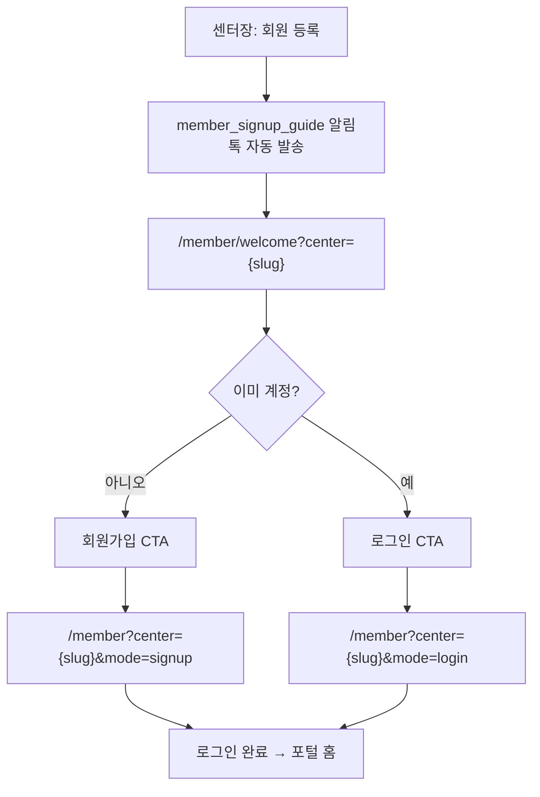

# MotionHub 회원 온보딩 개선 보고서

> 작성일: 2026-06-23  
> 배경: 베타 센터 피드백 — **「초기 세팅이 번거롭다」** (반복)  
> 목표: **설명 없이 30초 안에 「아 이거구나」** — 링크만내면 회원이 스스로 시작

---

## 1. 요약

| 구분 | 내용 |
|------|------|
| **핵심 문제** | 회원 등록 자체가 아니라 **회원 온보딩**(설명·가입·로그인·사용법)이 센터장 부담 |
| **제안 방향** | 알림톡 → **전용 온보딩 페이지** → 가입/로그인. 센터장은 **링크만 전달** |
| **현재 코드** | `/member` 단일 포털(로그인·가입 혼재), 알림톡 URL `https://motionhub.kr/member` 고정, **엑셀 일괄 등록 UI 존재** (`MemberImportPanel`) |
| **MVP 권장** | 프로젝트 1~5 (welcome 페이지 + 템플릿 + 영상 placeholder) |
| **예상 공수 (MVP)** | **3~4 인일** + 솔라피 템플릿 재심사 대기 |
| **예상 공수 (전체)** | **7~9 인일** (CSV·체크리스트·대량 발송 포함) |

---

## 2. 문제 분석

### 2.1 베타 피드백의 실체

```
센터장 → 회원 등록 → (구두) 회원가입 설명 → 로그인 설명 → 비밀번호 설명 → 사용법 설명
                                                              ↓
                                                        회원이 안 함
```

MotionHub는 **센터 관리자 × 회원** 이중 사용자 구조입니다. 관리자 기능은 점차 정비됐지만, **회원 첫 진입 경험**은 여전히 `/member` 로그인 화면에 바로 도달합니다.  
회원 입장에서는 「이게 뭐 하는 앱인지」를 알기 전에 **전화번호·비밀번호 입력**을 요구받습니다.

### 2.2 현재 기술 흐름 (As-Is)

| 단계 | 구현 위치 | 비고 |
|------|-----------|------|
| 회원 등록 | `src/api/members.ts` → `createMember` | 관리자·일괄 import 공통 |
| 가입 안내 발송 | `notifyMemberSignupGuide` | 회원당 1회 중복 방지 |
| 알림톡 템플릿 | `member_signup_guide` | 변수 `#{centerName}` |
| 링크 | `MOTIONHUB_MEMBER_SIGNUP_PORTAL_URL` = `/member` | `motionhubGuide.ts` |
| 회원 진입 | `MemberPortalPage` (`/member`) | 로그인·회원가입·포털 탭 혼재 |
| 센터 가이드 | `/guide` | **센터장용** (회원용 아님) |

### 2.3 갭 (Gap)

| 항목 | 현재 | 목표 |
|------|------|------|
| 온보딩 전용 URL | 없음 | `/member/welcome` |
| 5초 가치 제안 | 없음 | 「예약·출석·운동기록·수강권」 한 화면 |
| 30초 사용법 | 없음 | 3단계 + 영상 placeholder |
| 알림톡 링크 | `/member` | `/member/welcome` (+ `?center=slug`) |
| 센터장 체크리스트 | 없음 | 대시보드 진행률 0~100% |
| CSV 일괄 등록 | **엑셀만** (`MemberImportPanel`) | CSV + 가입 안내 일괄 발송 옵션 |

---

## 3. 프로젝트 1 — 회원 초대 플로우 개선 (UX 설계)

### 3.1 To-Be 플로우



### 3.2 설계 원칙

1. **welcome은 설명만** — 입력 폼 없음 (인지 부하 최소화)
2. **센터 코드 유지** — `?center=movel` 쿼리로 가입·로그인 화면에 센터 prefill
3. **딥링크** — CTA 클릭 시 `mode=signup|login` 쿼리로 `MemberPortalPage` 탭 자동 선택
4. **알림톡 1탭** — 본문 링크는 welcome만 (가입/로그인 분기는 페이지에서)

### 3.3 센터장 행동 변화

| Before | After |
|--------|-------|
| 「앱 켜서 회원가입 하세요」 | 「문자 링크 누르세요」 |
| 「비밀번호는 뒤 4자리예요」 | welcome 하단에 **한 줄** 안내 |
| 「예약은 여기…」 | welcome 30초 사용법으로 대체 |

---

## 4. 프로젝트 2 — `/member/welcome` 페이지 설계

### 4.1 URL·라우팅

| URL | 용도 |
|-----|------|
| `https://motionhub.kr/member/welcome` | 기본 (센터 미지정) |
| `https://motionhub.kr/member/welcome?center=movel` | **권장** — 센터별 온보딩 |

**라우트 추가:** `App.tsx`에 `/member/welcome` → `MemberWelcomePage` (신규)

로그인 사용자가 welcome 접속 시 → `/member?center=…` 로 redirect (이미 시작한 회원 혼란 방지).

### 4.2 화면 구조 (와이어프레임)

```
┌─────────────────────────────────────┐
│  [모션허브 로고]                      │
│                                     │
│  모션허브 시작하기                    │
│                                     │
│  {centerName} 회원 등록이 완료되었습니다. │
│                                     │
│  예약 · 출석 · 운동기록 · 수강권 확인    │
│  을 한 곳에서 관리할 수 있습니다.        │
│                                     │
│  ── 30초 사용법 ──                   │
│  ① 예약 확인                         │
│  ② 출석 확인                         │
│  ③ 운동기록 작성                      │
│  끝                                  │
│                                     │
│  [ 영상 placeholder — 프로젝트 3 ]     │
│                                     │
│  ┌─────────────┐ ┌─────────────┐    │
│  │  회원가입    │ │   로그인     │    │
│  └─────────────┘ └─────────────┘    │
│                                     │
│  초기 비밀번호: 휴대폰 뒤 4자리         │
└─────────────────────────────────────┘
```

### 4.3 UI·카피 상세

| 영역 | 카피 | 목적 |
|------|------|------|
| H1 | 모션허브 시작하기 | 브랜드 + 행동 유도 |
| 서브 | `{centerName}` 회원 등록이 완료되었습니다. | 센터 신뢰·맥락 |
| 가치 제안 | 예약 / 출석 / 운동기록 / 수강권 확인 | **5초 이해** |
| 30초 | ①②③ + 「끝」 | 부담 제거 |
| 푸터 힌트 | 초기 비밀번호: 휴대폰 뒤 4자리 | 센터장 구두 설명 제거 |
| Primary CTA | 회원가입 | 신규 회원 |
| Secondary CTA | 로그인 | 재방문·비밀번호 변경 회원 |

### 4.4 기술 구현 메모

| 파일 | 작업 |
|------|------|
| `src/pages/MemberWelcomePage.tsx` | **신규** — 정적 온보딩 UI |
| `src/App.tsx` | Route `/member/welcome` |
| `src/constants/motionhubGuide.ts` | `MOTIONHUB_MEMBER_WELCOME_URL` 추가 |
| `MemberPortalPage.tsx` | `mode=signup\|login` 쿼리 처리 (소규모) |
| `MemberLayout.tsx` | welcome은 로그인 전 레이아웃 (헤더만) |

**모바일 우선:** 한 컬럼, 스크롤 짧게, CTA sticky 하단 고정 권장.

---

## 5. 프로젝트 3 — 30초 소개 영상 섹션

### 5.1 1차 (영상 없음)

```tsx
// 개념: MemberWelcomeVideoSection
type VideoSource =
  | { type: 'placeholder' }
  | { type: 'youtube'; videoId: string }
  | { type: 'mp4'; url: string }
```

| 상태 | UI |
|------|-----|
| placeholder | 16:9 회색 박스 + 「30초 사용법 영상 준비 중」 + 4아이콘 카드 (예약·출석·기록·수강권) |
| youtube | `youtube-nocookie.com/embed/{id}` iframe |
| mp4 | `<video controls poster=…>` |

### 5.2 설정 확장 (2차, 선택)

- 센터별 영상 URL: `center_branding` 또는 `reward_settings` 키 `member_welcome_video`
- 플랫폼 기본 영상: MotionHub 공용 Shorts 1개

### 5.3 공수

| 범위 | 인일 |
|------|------|
| placeholder + 타입 설계 | 0.5 |
| YouTube/mp4 연동 + 관리자 설정 | +1.0 |

---

## 6. 프로젝트 4 — 회원가입 안내 템플릿 수정안

### 6.1 제안 본문 (Solapi 심사용)

```
안녕하세요.

#{centerName} 입니다.

회원 등록이 완료되었습니다.

예약
출석
운동기록
수강권 확인

을 이용할 수 있습니다.

시작하기
https://motionhub.kr/member/welcome

감사합니다.
```

센터별 링크가 필요하면 **템플릿 변수 추가 심사** 대신, 운영 초기에는 고정 URL + welcome 페이지에서 센터 선택/쿼리 처리를 권장합니다.  
(이미 `?center=slug` 패턴이 회원 포털에 존재)

**센터 slug 포함 링크 (발송 시 동적 삽입, 템플릿 변수 없이):**  
현재 `member_signup_guide`는 **본문 URL 고정** 정책입니다. slug별 URL을 알림톡에 넣으려면:

- **안 A (권장·단기):** 템플릿 본문 `https://motionhub.kr/member/welcome` 고정 → welcome에서 최근 등록 센터 또는 전화번호로 센터 매칭 (2차)
- **안 B:** `#{welcomeUrl}` 변수 추가 → Solapi 재심사

**단기 MVP는 안 A + welcome에서 `?center=` 쿼리 유지.**

### 6.2 코드 변경 목록

| 파일 | 변경 |
|------|------|
| `src/constants/alimtalkTemplates.ts` | `ALIMTALK_TEMPLATE_EXAMPLES.member_signup_guide` URL 변경 |
| `src/constants/motionhubGuide.ts` | `MOTIONHUB_MEMBER_WELCOME_PATH`, URL 상수 |
| `supabase/functions/_shared/templates.ts` | (변수 없으면 문서만) |
| Solapi 콘솔 | 템플릿 본문 수정 → **재심사** |
| Supabase Secret | `SOLAPI_TEMPLATE_MEMBER_SIGNUP_GUIDE` ID 유지 또는 갱신 |

### 6.3 발송 트리거 (변경 없음)

- 관리자 `createMember` → `notifyMemberSignupGuide`
- 자가가입 `registerMember` → 동일
- 일괄 import → `createMember` 경유 시 **동일 자동 발송** (이미 동작)

---

## 7. 프로젝트 5 — 센터장 설명 부담 제거

### 7.1 「설명 제거」 체크리스트

| 센터장이 하던 말 | 대체 수단 |
|------------------|-----------|
| 「MotionHub예요」 | welcome 상단 브랜드 + 알림톡 |
| 「예약·출석 여기서 해요」 | welcome 가치 제안 + 30초 사용법 |
| 「회원가입 누르세요」 | welcome CTA |
| 「비밀번호 뒤 4자리」 | welcome 푸터 + (선택) 알림톡 한 줄 |
| 「로그인하면 PT 보여요」 | 가입 후 포털 홈 첫 화면 카드 (2차) |

### 7.2 2차: 로그인 후 첫 방문 코치마크 (선택)

- `localStorage` `member_onboarding_seen_v1`
- 포털 홈에서 「예약 탭」「출석 버튼」 1회 하이라이트
- 공수 +1~1.5 인일

---

## 8. 프로젝트 6 — 회원 일괄 등록 (CSV) 설계

### 8.1 현재 상태

`MemberImportPanel` (`src/components/admin/MemberImportPanel.tsx`) 이 **이미 존재**:

- 엑셀(xlsx) 업로드
- 컬럼 매핑 (이름, 연락처, 잔여 PT, 만료일 등)
- `createMember` 루프 → **가입 안내 알림톡 자동 발송**

### 8.2 개선 설계

| 항목 | 설계 |
|------|------|
| **파일 형식** | CSV(UTF-8) + xlsx 유지. `parseCsvFile` 추가 |
| **최소 컬럼** | 이름, 전화번호, 잔여횟수, 만료일 |
| **선택 컬럼** | 트레이너, 결제금액, 등록일, 상태 |
| **템플릿 다운로드** | `MotionHub 회원등록양식.csv` (기존 excel 템플릿과 동일 컬럼) |
| **일괄 발송 옵션** | ☑ 가입 안내 알림톡 발송 (기본 ON) |
| **진행 UI** | N/M 처리, 실패 행 다운로드 |
| **중복 정책** | 전화번호 중복 시 스킵 + 리포트 |
| **Rate limit** | 50건/배치, 초과 시 큐 또는 수동 재시도 안내 |

### 8.3 API·데이터

- 별도 Edge Function 불필요 (1차) — 클라이언트에서 `createMember` 순차 호출
- 100건+ 시 `bulk-import-members` Edge Function 검토 (트랜잭션·발송 큐)

### 8.4 플로우

```
CSV 업로드 → 미리보기·검증 → [일괄 등록] → createMember × N → notifyMemberSignupGuide × N
```

---

## 9. 프로젝트 7 — 온보딩 체크리스트 (센터 관리자)

### 9.1 배치

**관리자 대시보드** (`DashboardPage`) 상단 또는 사이드바 — 「센터 시작하기」카드

### 9.2 체크 항목·완료 조건

| # | 항목 | 완료 조건 (자동 판정) |
|---|------|------------------------|
| 1 | 센터 정보 입력 | `center_branding.name` 존재 또는 설정 페이지 저장 이력 |
| 2 | 회원 등록 | `members` count ≥ 1 |
| 3 | 수강권 등록 | `member_session_passes` 또는 PT `payment_history` ≥ 1 |
| 4 | 첫 예약 생성 | `pt_schedules` 또는 `class_schedules` status=scheduled ≥ 1 |
| 5 | 첫 회원 로그인 | `member_login_logs` 또는 credentials `updated_at` > created |

### 9.3 UI

```
센터 시작하기                    60%
████████████░░░░░░░░
☑ 센터 정보 입력
☑ 회원 등록
☑ 수강권 등록
□ 첫 예약 생성        [일정 만들기 →]
□ 첫 회원 로그인      [가입 안내 재발송 →]
```

- 진행률 = 완료 항목 / 5 × 100%
- 미완료 항목에 **딥링크** (`/admin/settings`, `/admin/members`, …)
- 100% 시 카드 접기·축하 메시지

### 9.4 저장

- `reward_settings` 키 `center_onboarding_dismissed` — 완료 후 숨김
- 또는 `localStorage` + 서버 집계 병행

---

## 10. 예상 개발 공수

| 프로젝트 | 범위 | 인일 | 비고 |
|----------|------|------|------|
| **P1** 초대 플로우 | welcome 라우트, CTA 딥링크, center 쿼리 | 0.5 | |
| **P2** welcome 페이지 | UI·반응형·카피 | 1.0 | |
| **P3** 영상 placeholder | 섹션 컴포넌트 + 확장 타입 | 0.5 | |
| **P4** 알림톡 템플릿 | 상수·문서·Solapi 재등록 | 0.5 | **심사 1~3일 별도** |
| **P5** 설명 부담 제거 | P2 카피에 포함 | — | |
| **소계 MVP** | P1~P5 | **3~4 인일** | 1 스프린트 |
| **P6** CSV 일괄 | CSV 파서, UI, 발송 옵션 | 2.0 | 엑셀 기반 확장 |
| **P6+** 대량 import API | 100건+ Edge Function | +1.5 | 선택 |
| **P7** 체크리스트 | 집계 RPC·대시보드 UI | 2.0 | |
| **2차** 로그인 후 코치마크 | 포털 첫 방문 | 1.5 | 선택 |
| **전체** | P1~P7 | **7~9 인일** | 2 스프린트 |

**QA·베타 재검증:** +1 인일  
**Solapi 템플릿 재심사:** 개발 일정과 병렬, 승인 전까지 구 URL(`/member`) 병행 가능

---

## 11. 권장 롤아웃 순서

| 단계 | 내용 | 센터 영향 |
|------|------|-----------|
| **Phase 1** | `/member/welcome` 배포, 알림톡 URL 변경 (심사 후) | 즉시 체감 |
| **Phase 2** | 대시보드 온보딩 체크리스트 | 센터장 세팅 부담 ↓ |
| **Phase 3** | CSV + 일괄 가입 안내 | 대량 이관 센터 |
| **Phase 4** | 영상·코치마크 | 완성도 |

---

## 12. 성공 지표 (KPI)

| 지표 | 측정 방법 | 목표 (베타 후 4주) |
|------|-----------|-------------------|
| welcome → 가입/로그인 클릭률 | 페이지 이벤트 | ≥ 40% |
| 가입 안내 발송 후 7일 내 첫 로그인 | `member_login_logs` | ≥ 30% |
| 센터장 「온보딩 설명」 피드백 | 베타 설문 | 감소 |
| 체크리스트 100% 센터 비율 | onboarding RPC | ≥ 50% (신규 센터) |

---

## 13. 리스크·의존성

| 리스크 | 대응 |
|--------|------|
| Solapi 템플릿 재심사 지연 | welcome 먼저 배포, QR/수동 링크 공유 |
| `?center=` 없이 welcome 접속 | 센터 검색 UI (기존 `CenterSearchPicker` 재사용) |
| 일괄 발송 알림톡 크레딧 | import 전 잔여 크레딧 표시 |
| welcome과 `/member` 중복 | 로그인 회원 welcome 접속 시 포털 redirect |

---

## 14. 산출물 체크리스트

- [x] 1. 회원 온보딩 UX 설계안 — §3, §5
- [x] 2. `/member/welcome` 페이지 설계 — §4
- [x] 3. 회원가입 안내 템플릿 수정안 — §6
- [x] 4. CSV 회원 업로드 설계 — §8
- [x] 5. 온보딩 체크리스트 설계 — §9
- [x] 6. 예상 개발 공수 — §10

---

## 15. 다음 액션 (구현 착수 시)

1. `MemberWelcomePage` + 라우트 추가
2. `motionhubGuide.ts` URL 상수 분리 (`/member` vs `/member/welcome`)
3. Solapi `member_signup_guide` 본문 수정·심사 요청
4. 베타 1개 센터에 welcome 링크 A/B (기존 `/member` vs welcome)
5. 체크리스트·CSV는 Phase 2~3 일정 확정 후 착수

---

*관련 코드: `MemberPortalPage.tsx`, `MemberImportPanel.tsx`, `notifyMemberSignupGuide`, `docs/member-signup-guide-template-report.md`*
