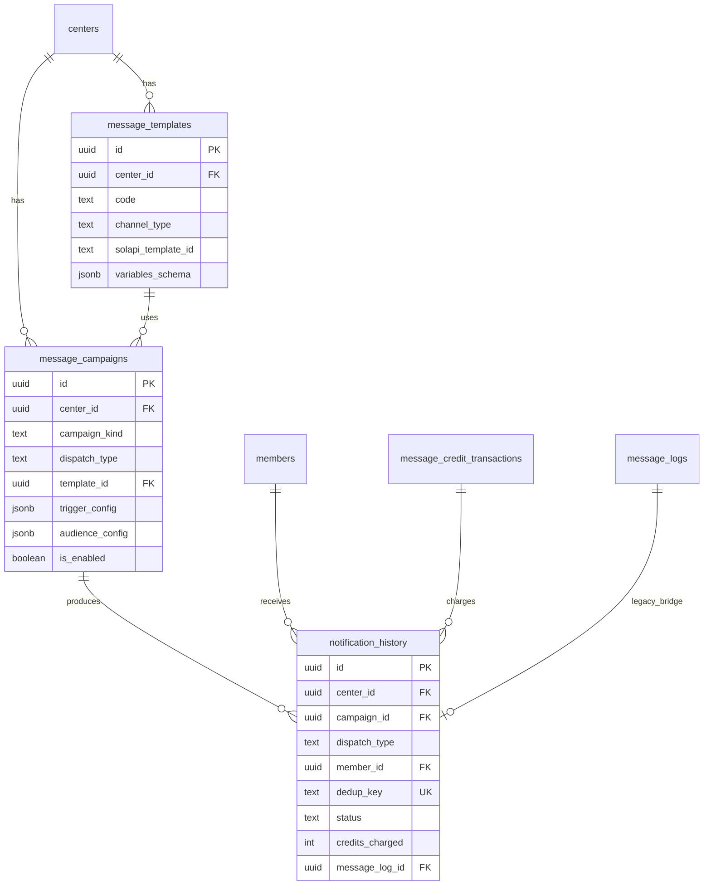

# 메시지센터 아키텍처 설계

> 작성일: 2026-06-05  
> **현재 단계:** 자동발송만 구현 (`/admin/messages`, `message_logs`, Edge Functions)  
> **이번 단계에서 하지 않음:** 공지·개별·CRM UI  
> **목표:** 향후 기능 추가 시 **DB 재설계 없이** 확장

---

## 1. 메뉴 구조 (목표 UX)

```
메시지 (/admin/messages)
├ 자동발송      /admin/messages/automatic     ← 현재 구현
├ 공지발송      /admin/messages/announcements  (향후)
├ 개별발송      /admin/messages/direct         (향후, 회원 상세 [메시지 보내기] 연동)
├ CRM 캠페인    /admin/messages/crm           (향후)
└ 발송이력      /admin/messages/history       (향후, 통합 조회)
```

| 탭 | 발송 주체 | 트리거 | 크레딧 |
|----|-----------|--------|--------|
| 자동발송 | 시스템 | 이벤트·스케줄 | 1건 = 1크레딧 |
| 공지발송 | 센터 관리자 | 수동 작성 + 대상 선택 | 수신자 수만큼 |
| 개별발송 | 센터 관리자 | 회원 1명 선택 | 1크레딧 |
| CRM 캠페인 | 센터 관리자 | 조건 필터 후 일괄 | 실제 발송 성공 수만큼 |
| 발송이력 | — | 조회 전용 | — |

---

## 2. 핵심 엔티티



### 2.1 `message_templates` — 메시지 양식

센터별·시스템 공통 **알림톡/문자 템플릿 메타데이터**.

| 컬럼 | 설명 |
|------|------|
| `center_id` | NULL = 플랫폼 기본 템플릿, UUID = 센터 커스텀(향후) |
| `code` | `welcome`, `pt_reminder`, `announcement_freeform` 등 |
| `channel_type` | `alimtalk` \| `sms` \| `lms` |
| `solapi_template_id` | 솔라피 템플릿 ID (센터 관리자 UI에 노출하지 않음) |
| `variables_schema` | `#{name}` 등 치환 변수 정의 |
| `usage_scope` | `automatic` \| `announcement` \| `direct` \| `campaign` \| `all` |

**원칙:** 솔라피 연동 정보는 DB/Edge에만 두고, 센터 관리자 화면에는 **템플릿 이름·미리보기**만 표시.

### 2.2 `message_campaigns` — 캠페인·자동발송 규칙

하나의 행이 **자동발송 규칙** 또는 **향후 공지/CRM 캠페인 1건**을 나타냄.

| 컬럼 | 설명 |
|------|------|
| `campaign_kind` | `automatic` \| `announcement` \| `direct` \| `crm` |
| `dispatch_type` | `notification_history.dispatch_type`와 동일 enum |
| `template_id` | 사용 템플릿 FK |
| `trigger_config` | 자동발송: 이벤트·조건 JSON (아래 §3) |
| `audience_config` | 공지/CRM: 대상 세그먼트·필터 JSON (아래 §4) |
| `status` | `active` \| `draft` \| `scheduled` \| `completed` \| `cancelled` |
| `is_enabled` | 자동발송 ON/OFF (센터별) |

**자동발송 시드 예시 (migration 072):**

| code | trigger |
|------|---------|
| `auto_welcome` | 회원 등록 |
| `auto_payment_done` | 결제 완료 |
| `auto_renewal` | 만료 D-7/3/1 |
| `auto_pt_reminder` | PT 24시간 전 |
| `auto_pt_sessions_3` | PT 잔여 ≤3회 (향후) |
| `auto_pt_sessions_1` | PT 잔여 ≤1회 (향후) |
| `auto_membership_expiry` | 회원권 만료 (향후) |
| `auto_class_reminder` | 수업 24시간 전 (향후) |

### 2.3 `notification_history` — 통합 발송 이력

`message_logs`의 **상위 호환** 테이블. 모든 발송 유형이 여기에 수렴.

| 컬럼 | 설명 |
|------|------|
| `dispatch_type` | `automatic` \| `announcement` \| `direct` \| `campaign` |
| `campaign_id` | 어떤 캠페인/규칙에서 나왔는지 |
| `batch_id` | 공지·CRM 일괄 발송 묶음 UUID |
| `member_id`, `phone` | 수신자 |
| `status` | `pending` \| `sent` \| `failed` \| `skipped` |
| `credits_charged` | 실제 차감 크레딧 (0 = 스킵/실패) |
| `dedup_key` | 중복 방지 키 (센터 내 unique, nullable) |
| `resend_of_id` | 재발송 시 원본 이력 FK |
| `message_log_id` | **이행 기간** legacy `message_logs` 연결 |

---

## 3. 자동발송 (`dispatch_type = automatic`)

### 3.1 트리거 모델 (`trigger_config`)

```json
{
  "event": "pt_schedule_reminder",
  "offset_hours": 24,
  "window_hours": 1,
  "dedup_scope": ["member_id", "schedule_id"]
}
```

| event | 설명 | 현재 구현 |
|-------|------|-----------|
| `member_welcome` | 신규 회원 | ✅ `welcome` |
| `payment_completed` | 결제 완료 | ✅ `payment_done` |
| `membership_renewal` | 만료 D-n | ✅ `renewal` |
| `pt_schedule_reminder` | PT D-1 | ✅ `pt_reminder` |
| `pt_sessions_threshold` | 잔여 n회 이하 | 🔜 |
| `membership_expiry` | 회원권 만료 | 🔜 |
| `class_schedule_reminder` | 수업 D-1 | 🔜 |

### 3.2 실행 경로 (현재 → 목표)

```
[현재]
  Edge sendMemberNotification()
    → message_logs INSERT
    → try_consume_message_credits(1)

[이행 2단계 — dual-write]
  Edge sendMemberNotification()
    → message_logs INSERT (유지)
    → notification_history INSERT
    → campaign_id = message_campaigns.id (trigger로 조회)

[이행 3단계]
  UI 발송이력 → notification_history 단일 조회
  message_logs 읽기 전용 / deprecated
```

**이번 단계:** 기존 Edge·`message_logs` **변경 없음**. migration 072는 테이블·시드만 추가.

---

## 4. 공지발송 (향후, `dispatch_type = announcement`)

### 4.1 대상 세그먼트 (`audience_config`)

```json
{
  "segments": ["all", "active", "pt", "pilates", "yoga", "gx"],
  "exclude_terminated": true
}
```

| segment | 조건 |
|---------|------|
| `all` | 센터 전체 회원 |
| `active` | status = active |
| `pt` | remaining_sessions > 0 또는 PT 이용 이력 |
| `pilates` / `yoga` / `gx` | `member_session_passes.pass_type` |

### 4.2 발송 흐름 (설계)

1. 관리자가 제목·본문(또는 템플릿) 작성
2. `message_campaigns` INSERT (`campaign_kind=announcement`, `status=scheduled`)
3. 대상 회원 resolve → N건 `notification_history` (`pending`)
4. 발송 전 **잔여 크레딧 ≥ N** 검증
5. 건별 Solapi 호출, 성공 시 `credits_charged=1` 누적 차감
6. `batch_id`로 묶어 발송이력에서 일괄 조회

---

## 5. 개별발송 (향후, `dispatch_type = direct`)

- 회원 상세 `/admin/member/:id` → **[메시지 보내기]**
- `message_campaigns` 1건 (`campaign_kind=direct`, 단발)
- `notification_history` 1건
- 크레딧 1건 (성공 시)

---

## 6. CRM 캠페인 (향후, `dispatch_type = campaign`)

### 6.1 규칙 예시 (`audience_config` + `trigger_config`)

```json
{
  "rule_type": "no_attendance_days",
  "days": 14
}
```

| rule_type | 설명 |
|-----------|------|
| `no_attendance_days` | 최근 n일 미출석 |
| `membership_expires_within` | 만료 n일 이내 |
| `pt_sessions_lte` | PT 잔여 n회 이하 |
| `birthday_today` | 생일 당일 |

1. 필터 미리보기 (대상 N명)
2. 확인 후 `batch_id` 발급 → 일괄 발송
3. **실제 sent 건수만** 크레딧 차감

---

## 7. 메시지 크레딧 정책 (통합)

| dispatch_type | 차감 시점 | 금액 |
|---------------|-----------|------|
| `automatic` | 발송 **성공** 후 | 1 |
| `announcement` | 수신자별 성공 후 | 1 × 성공 수 (발송 전 잔여 ≥ 예상 대상 수 권장) |
| `direct` | 성공 후 | 1 |
| `campaign` | 성공 후 | 1 × 성공 수 |
| skipped / failed | — | **0** |

기존 `try_consume_message_credits` RPC 유지. 향후 bulk 시:

- `reserve_message_credits(center_id, amount)` (선택)
- 또는 건별 `try_consume` (현재와 동일, 구현 단순)

`notification_history.credits_charged`에 실제 차감액 기록 → 발송이력·정산 일치.

---

## 8. 중복 발송 방지 · 재발송

### 8.1 `dedup_key` 규칙

센터별 partial unique: `(center_id, dedup_key)` WHERE dedup_key IS NOT NULL

| 유형 | dedup_key 예시 |
|------|----------------|
| welcome | `auto:welcome:{member_id}` |
| payment | `auto:payment:{payment_id}` |
| renewal | `auto:renewal:{member_id}:d{days_left}:{date}` |
| pt_reminder | `auto:pt:{schedule_id}` |
| announcement | NULL (의도적 재공지 가능) 또는 `ann:{campaign_id}:{member_id}` |
| direct | NULL |
| campaign | `crm:{campaign_id}:{member_id}` |
| 재발송 | dedup_key NULL + `resend_of_id` 설정 |

### 8.2 재발송

- 발송이력에서 **재발송** 클릭 시 `resend_of_id` = 원본 ID
- `dedup_key`는 비워 새 row 생성 (또는 `:resend:{timestamp}` suffix)

---

## 9. `message_logs`와의 관계

| 항목 | message_logs (legacy) | notification_history (목표) |
|------|----------------------|----------------------------|
| 용도 | 현재 운영·Edge 기록 | 통합 발송이력 |
| template | `template_key` text | `template_id` + `template_code` |
| 캠페인 | 없음 | `campaign_id` |
| 발송 유형 | 암묵적 automatic | `dispatch_type` 명시 |
| 크레딧 | transactions metadata | `credits_charged` 컬럼 |

**이행:** `message_log_id` FK로 1:1 연결 가능. 기존 dedup 인덱스는 당분간 유지.

---

## 10. API · Edge 설계 (향후)

```
POST /functions/v1/send-message
  body: {
    dispatch_type,
    campaign_id?,
    member_id | audience_batch,
    template_code,
    variables,
    dedup_key?
  }

공통 파이프라인:
  1. center enabled + credits check
  2. dedup_key conflict → skipped
  3. Solapi send
  4. notification_history upsert
  5. try_consume_message_credits (성공 시)
```

현재 `send-notification` / `sendMemberNotification`은 **그대로** 두고, 2단계에서 내부적으로 `notification_history` dual-write.

---

## 11. 권한

| 역할 | 자동발송 ON/OFF | 공지/CRM 발송 | 발송이력 | 크레딧 지급 |
|------|----------------|---------------|----------|-------------|
| 센터 관리자 | 조회·수동 실행 | 향후 | 조회 | 조회만 |
| 트레이너 | — | — | — | — |
| 슈퍼관리자 | — | — | 플랫폼 전체 | 지급 |

---

## 12. 구현 로드맵

| 단계 | 내용 | DB 변경 |
|------|------|---------|
| **0 (현재)** | 자동발송 UI, message_logs, 크레딧 | 065, 071 |
| **1** | foundation 테이블 + 자동발송 시드 | **072** |
| **2** | Edge dual-write → notification_history | 없음 |
| **3** | 발송이력 UI (통합) | 없음 |
| **4** | 공지발송 | 없음 |
| **5** | 개별발송 + 회원 상세 버튼 | 없음 |
| **6** | CRM 캠페인 빌더 | 없음 |
| **7** | message_logs 읽기 전용 | 없음 |

---

## 13. 관련 파일

| 파일 | 역할 |
|------|------|
| `supabase/migration_072_message_center_foundation.sql` | 기초 테이블·시드 |
| `src/types/messageCenter.ts` | TypeScript 도메인 타입 |
| `supabase/functions/_shared/notifications.ts` | 현재 발송 엔진 |
| `src/api/messageCampaigns.ts` | 현재 자동발송 (유지) |
| `supabase/migration_072_message_center_foundation.sql` | 메시지센터 기초 테이블 (선택 적용) |

---

## 14. 배포 참고

foundation만 적용할 때:

```bash
supabase db query --linked -f supabase/migration_072_message_center_foundation.sql
```

**운영 발송 동작은 migration 072 적용 전후 동일**합니다 (테이블만 추가).
