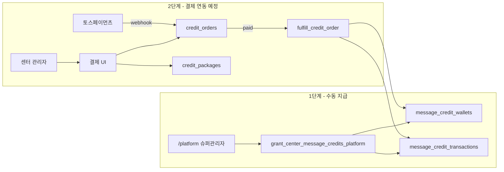

# 메시지 크레딧 결제 구조 설계

> 작성일: 2026-06-05  
> **현재 단계:** 슈퍼관리자 **수동 지급**만 운영 (베타 검증)  
> **구현 금지:** PG 연동, 구독 자동결제, 센터 셀프 결제 UI

---

## 1. 목표

| 단계 | 내용 | 상태 |
|------|------|------|
| **1단계 (현재)** | 플랫폼에서 센터별 메시지 크레딧 수동 지급 | ✅ 운영 |
| **2단계 (설계)** | `credit_packages` + `credit_orders` + 토스페이먼츠 | 🔜 스키마만 |

베타 기간 동안 MotionHub 운영자가 **+30 / +100 / +500 / 직접입력**으로 지급하며 사용 패턴을 검증합니다.

---

## 2. 기존 vs 신규 테이블



| 테이블 | 역할 | 1단계 | 2단계 |
|--------|------|-------|-------|
| `message_credit_wallets` | 센터 잔액 | ✅ | ✅ |
| `message_credit_transactions` | 원장 (bonus / manual_grant / usage / purchase) | ✅ | ✅ |
| `message_credit_products` | **레거시** 상품 (065) | 참고용 | → `credit_packages`로 이전 |
| `credit_packages` | 판매 패키지 카탈로그 | 시드만 | ✅ |
| `credit_orders` | 결제·주문 상태 | 빈 테이블 | ✅ |

**구독 요금제(`subscription_plans`)와 메시지 크레딧은 완전 분리**합니다.

---

## 3. 1단계 — 슈퍼관리자 수동 지급

### UI (`/platform`)

- 센터 목록 **메시지** 컬럼: 잔여 / 이번 달 / 알림톡 ON·OFF
- **크레딧** 버튼 → `PlatformCenterCreditsModal`
  - **+30 / +100 / +500** 프리셋
  - **직접 입력** + 지급

### API

```
RPC grant_center_message_credits_platform(
  p_session_token,
  p_center_id,
  p_amount,
  p_description?
)
→ grant_message_credits(..., 'manual_grant', ...)
```

### 거래 기록

| 필드 | 값 |
|------|-----|
| `type` | `manual_grant` |
| `metadata.source` | `platform_admin` |
| `description` | `수동 지급 +N건` 등 |

**`credit_orders` 행은 생성하지 않음** (실결제가 아니므로).

---

## 4. 2단계 — `credit_packages`

센터가 **구매할 수 있는** 메시지 크레딧 상품 (플랫폼 공통 카탈로그).

| 컬럼 | 설명 |
|------|------|
| `code` | `pkg_100`, `pkg_500`, `pkg_1000` |
| `quantity` | 지급 크레딧 건수 |
| `label` | 표시명 |
| `price_krw` | 판매가 (원). 베타: 0 또는 미정 |
| `currency` | `KRW` |
| `is_active` | 판매 여부 |
| `metadata` | 토스 상품 연동용 확장 필드 |

### 기본 시드

| code | quantity | label |
|------|----------|-------|
| pkg_100 | 100 | 100건 |
| pkg_500 | 500 | 500건 |
| pkg_1000 | 1000 | 1,000건 |

`message_credit_products`(065) 데이터가 있으면 migration 073에서 `credit_packages`로 복사합니다.

---

## 5. 2단계 — `credit_orders`

결제 시도 ~ 완료 ~ 환불까지 **주문 단위** 상태 관리.

### status

| status | 의미 |
|--------|------|
| `pending` | 주문 생성, 결제 대기 |
| `paid` | 결제 완료, 크레딧 지급 완료 |
| `cancelled` | 미결제 취소 / 만료 |
| `refund` | 환불 (크레딧 회수 정책은 별도) |

### 주요 컬럼

| 컬럼 | 설명 |
|------|------|
| `center_id` | 구매 센터 |
| `package_id` | `credit_packages` FK |
| `credits` | 주문 시점 확정 건수 (스냅샷) |
| `amount_krw` | 주문 시점 확정 금액 |
| `payment_provider` | `toss` (향후). 수동 지급은 **주문 미사용** |
| `provider_order_id` | 토스 `orderId` |
| `provider_payment_key` | 토스 `paymentKey` |
| `provider_receipt_url` | 영수증 URL |
| `credit_transaction_id` | 지급 후 `message_credit_transactions` 연결 |
| `paid_at` / `cancelled_at` / `refunded_at` | 상태 시각 |

### 토스페이먼츠 연동 시 (설계만)

```
1. create_credit_order(center_id, package_id)
   → credit_orders INSERT status=pending
   → return order_id, amount_krw, order_name

2. 클라이언트 토스 결제창 (향후)

3. POST /functions/v1/toss-payment-webhook
   → verify signature
   → fulfill_credit_order(order_id, payment_key)
   → grant_message_credits(type=purchase)
   → credit_orders.status=paid
```

**추가 DB 마이그레이션 없이** `payment_provider`, `provider_*` 컬럼과 `fulfill_credit_order` RPC만 연결하면 됩니다.

---

## 6. 크레딧 원장 type 정리

| type | 출처 | 1단계 | 2단계 |
|------|------|-------|-------|
| `bonus` | 베타 30건 등 | ✅ | ✅ |
| `manual_grant` | 슈퍼관리자 수동 | ✅ | ✅ |
| `purchase` | `credit_orders` 결제 완료 | — | ✅ |
| `usage` | 발송 차감 | ✅ | ✅ |
| `refund` | 환불·조정 | — | ✅ |

---

## 7. 권한·안전

| 작업 | 슈퍼관리자 | 센터 관리자 | 트레이너 |
|------|------------|-------------|----------|
| 수동 지급 | ✅ | ❌ | ❌ |
| 잔액 조회 | ✅ (플랫폼) | ✅ (본 센터) | ❌ |
| 패키지 목록 | — | 향후 | — |
| 주문 생성/결제 | — | 향후 | — |

모든 wallet/transaction/order는 **`center_id` 스코프** 필수.

---

## 8. 구현 로드맵

| # | 작업 | DB |
|---|------|-----|
| 0 | 수동 지급 UI + RPC | 065, 071 |
| 1 | 메시지센터 foundation | 072 |
| 2 | **credit_packages + credit_orders** | **073** |
| 3 | Edge dual-write notification_history | — |
| 4 | 센터 크레딧 충전 UI | — |
| 5 | 토스 결제창 + webhook | — |

---

## 9. 관련 파일

| 파일 | 설명 |
|------|------|
| `supabase/migration_073_credit_packages_orders.sql` | 패키지·주문 테이블 |
| `src/types/creditCommerce.ts` | TypeScript 타입 |
| `src/components/platform/PlatformCenterCreditsModal.tsx` | 수동 지급 UI |
| `src/api/platformMessageCredits.ts` | 플랫폼 API |
| `docs/message-credit-stabilization.md` | 크레딧·발송 정책 |

---

## 10. 베타 운영 체크리스트

1. 신규 센터 생성 → 베타 30건 자동 지급 확인
2. 크레딧 소진 센터 → `/platform`에서 +100 지급
3. 센터 `/admin/messages`에서 잔여·발송 테스트
4. `message_credit_transactions`에 `manual_grant` / `usage` 기록 확인
5. **credit_orders는 비어 있어도 정상** (결제 미구현)
