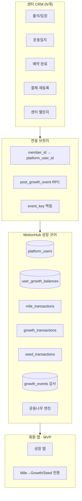
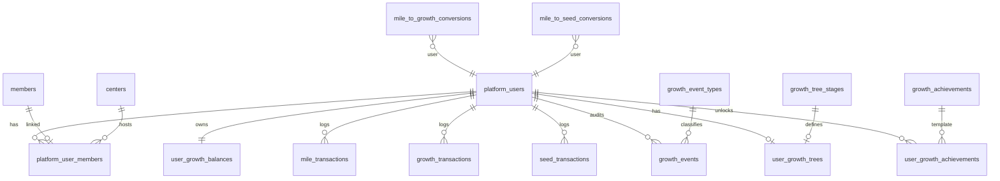

# MotionHub 성장 시스템 MVP 설계서 (Beta)

> **버전:** MVP Beta v2 · 2026-06-05  
> **상태:** 기획·설계만 (구현 금지)  
> **이전 문서:** `motionhub-growth-system-design.md` (Score 이중 모델) → **본 문서로 대체**  
> **MVP 검증 목표:** *「센터를 옮겨도 계속 성장하는 운동나무」*

---

## 0. 핵심 철학

MotionHub는 단순 회원관리 SaaS가 아니다.

| 주체 | 역할 |
|------|------|
| **회원** | 운동을 통해 성장한다 |
| **센터** | 회원의 성장을 돕는다 (출석·일지·챌린지·이벤트) |
| **MotionHub** | 그 성장을 **기록**하고 **시각화**한다 |

**운동 습관이 성장으로 보이는 플랫폼** — MotionHub만의 차별화 축.

---

## 1. 공식 용어 · 재화 체계

### 1.1 마일 (Mile)

**현실 가치 포인트**

| 구분 | 내용 |
|------|------|
| **획득** | 결제, 재등록, 추천, 이벤트, 걸음·센터인증 등 (기존 로직 계승) |
| **사용** | 할인, 쿠폰, 센터 혜택, **성장 가속** (→ 성장치·씨앗 전환) |
| **특성** | 유효기간·FIFO lot 가능 (기존 `reward_mile_lots` 패턴) |

### 1.2 성장치 (Growth)

**영구 경험치** — 한 번 오르면 **절대 감소하지 않음**

| 구분 | 내용 |
|------|------|
| **획득** | 출석, 운동일지 작성, 예약 후 출석, 챌린지, 센터 이벤트, 마일 전환 |
| **역할** | 회원 성장 레벨, **운동나무** 단계, 업적·칭호 (2차) |
| **사용** | 없음 (소비 재화 아님) |

### 1.3 씨앗 (Seed)

**꾸미기 재화** — MVP에서는 **잔액·전환만**, 소비 UI는 2차

| 구분 | 내용 |
|------|------|
| **획득** | 출석, 운동일지, 챌린지, 센터 이벤트, 마일 전환 |
| **사용 (2차~)** | 나무·꽃·벤치·분수·길·건물·장식물 |
| **특성** | 증감 가능, 성장치와 분리 |

### 1.4 재화 관계 (단방향만 허용)

```
                    ┌─────────────┐
                    │    Mile     │
                    └──────┬──────┘
                           │
              ┌────────────┼────────────┐
              ▼                         ▼
       ┌─────────────┐           ┌─────────────┐
       │   Growth    │           │    Seed     │
       │  (영구 XP)  │           │ (꾸미기)    │
       └─────────────┘           └─────────────┘
              │                         │
              │    ✕ 상호·역전환 없음    │
              └─────────────────────────┘
```

| 전환 | 허용 |
|------|------|
| Mile → Growth | ✅ |
| Mile → Seed | ✅ |
| Growth → Mile | ❌ |
| Growth → Seed | ❌ |
| Seed → Growth | ❌ |
| Seed → Mile | ❌ |

**기본 비율 (Beta):** 1 Mile = 1 Growth, 1 Mile = 1 Seed (정책 테이블로 조정 가능)

---

## 2. 최종 시스템 아키텍처

### 2.1 글로벌 계정

성장 데이터는 **센터가 아닌 MotionHub `platform_users`** 기준.

```
MOVEL 이용 → ABC PT 이용 → 필라테스 센터 이용
         ↓ 동일 platform_user_id
  Mile · Growth · Seed · 운동나무 · (2차) 업적·칭호·마을 — 모두 유지
```

**현재 Gap:** `reward_balances`가 `members.id`(센터별)에 묶여 있음 → MVP에서 플랫폼 원장으로 승격.

### 2.2 레이어 다이어그램



### 2.3 성장 루프 (MVP)

```
운동 행동 (출석·일지·예약 이행)
        ↓
  post_growth_event
        ↓
  Growth ↑ (+ 선택적 Seed ↑, Mile은 기존 규칙)
        ↓
  lifetime_growth 재계산
        ↓
  운동나무 단계 승급 (10 → 100 → 500 → 1,000 → 3,000)
        ↓
  성장 탭 시각화
```

### 2.4 단일 진입점: `post_growth_event`

모든 적립·전환·(관리자) 조정은 **하나의 RPC**로 수렴.

```typescript
type GrowthCurrency = 'mile' | 'growth' | 'seed'

type PostGrowthEventInput = {
  platform_user_id: string
  event_type: string           // growth_events 마스터 참조
  event_key: string            // 멱등 (unique per user)
  mile_delta?: number          // +/-
  growth_delta?: number        // + only (음수 시 reject)
  seed_delta?: number          // +/-
  source_center_id?: string
  source_member_id?: string
  reference_type?: string
  reference_id?: string
  metadata?: Record<string, unknown>
}
```

**검증 규칙 (RPC 내부)**

- `growth_delta < 0` → 거부 (성장치 감소 불가)
- `seed_delta` / `mile_delta` 음수 → 잔액 부족 시 거부
- Mile → Growth/Seed 전환 → 별도 `event_type` + `mile_to_growth_conversions` 감사

---

## 3. DB ERD

### 3.1 전체 관계도



### 3.2 테이블 정의

#### `platform_users`

```sql
create table platform_users (
  id                  uuid primary key default gen_random_uuid(),
  phone_normalized    text not null unique,       -- 010xxxxxxxx
  display_name        text,
  status              text not null default 'active'
                      check (status in ('active','suspended','deleted')),
  created_at          timestamptz not null default now(),
  updated_at          timestamptz not null default now()
);
```

#### `platform_user_members`

```sql
create table platform_user_members (
  id                  uuid primary key default gen_random_uuid(),
  platform_user_id    uuid not null references platform_users(id) on delete cascade,
  member_id           uuid not null references members(id) on delete cascade,
  center_id           uuid not null references centers(id) on delete cascade,
  linked_at           timestamptz not null default now(),
  unique (member_id),
  unique (platform_user_id, center_id)  -- 센터당 1 링크
);
```

#### `user_growth_balances` (캐시)

```sql
create table user_growth_balances (
  platform_user_id    uuid primary key references platform_users(id) on delete cascade,
  mile_balance        integer not null default 0 check (mile_balance >= 0),
  growth_total        integer not null default 0 check (growth_total >= 0),  -- 영구 누적
  seed_balance        integer not null default 0 check (seed_balance >= 0),
  tree_stage_key      text not null default 'none',
  title_key           text,                    -- 2차 칭호
  updated_at          timestamptz not null default now()
);
```

> `growth_total` = 성장치. **감소 없음** — 원장 합과 reconcile.

#### `mile_transactions`

```sql
create table mile_transactions (
  id                  uuid primary key default gen_random_uuid(),
  platform_user_id    uuid not null references platform_users(id) on delete cascade,
  amount              integer not null,
  balance_after       integer not null,
  event_type          text not null,
  event_key           text,
  source_center_id    uuid references centers(id),
  source_member_id    uuid references members(id),
  reference_type      text,
  reference_id        uuid,
  expires_at          timestamptz,
  note                text,
  metadata            jsonb not null default '{}',
  created_at          timestamptz not null default now()
);
create unique index mile_tx_event_key_uidx
  on mile_transactions (platform_user_id, event_key) where event_key is not null;
```

#### `growth_transactions`

```sql
create table growth_transactions (
  id                  uuid primary key default gen_random_uuid(),
  platform_user_id    uuid not null references platform_users(id) on delete cascade,
  amount              integer not null check (amount > 0),  -- 적립만
  growth_total_after  integer not null,
  event_type          text not null,
  event_key           text,
  source_center_id    uuid references centers(id),
  source_member_id    uuid references members(id),
  reference_type      text,
  reference_id        uuid,
  note                text,
  metadata            jsonb not null default '{}',
  created_at          timestamptz not null default now()
);
create unique index growth_tx_event_key_uidx
  on growth_transactions (platform_user_id, event_key) where event_key is not null;
```

#### `seed_transactions`

```sql
create table seed_transactions (
  id                  uuid primary key default gen_random_uuid(),
  platform_user_id    uuid not null references platform_users(id) on delete cascade,
  amount              integer not null,
  balance_after       integer not null,
  event_type          text not null,
  event_key           text,
  source_center_id    uuid references centers(id),
  source_member_id    uuid references members(id),
  reference_type      text,
  reference_id        uuid,
  note                text,
  metadata            jsonb not null default '{}',
  created_at          timestamptz not null default now()
);
create unique index seed_tx_event_key_uidx
  on seed_transactions (platform_user_id, event_key) where event_key is not null;
```

#### `growth_events` (감사·디버그·피드 소스)

`post_growth_event` 호출 1회 = 1 row (트랜잭션과 1:N 가능)

```sql
create table growth_events (
  id                  uuid primary key default gen_random_uuid(),
  platform_user_id    uuid not null references platform_users(id) on delete cascade,
  event_type          text not null,
  event_key           text not null,
  mile_delta          integer not null default 0,
  growth_delta        integer not null default 0,
  seed_delta          integer not null default 0,
  source_center_id    uuid references centers(id),
  source_member_id    uuid references members(id),
  payload             jsonb not null default '{}',
  created_at          timestamptz not null default now(),
  unique (platform_user_id, event_key)
);
```

#### `growth_achievements` / `user_growth_achievements` (MVP: 스키마만, UI 2차)

```sql
create table growth_achievements (
  achievement_key     text primary key,
  category            text not null,
  display_name_ko     text not null,
  description_ko      text not null,
  condition_type      text not null,
  condition_value     jsonb not null,
  reward_growth       integer not null default 0,
  reward_seed         integer not null default 0,
  reward_mile         integer not null default 0,
  title_key           text,
  is_active           boolean not null default true
);

create table user_growth_achievements (
  platform_user_id    uuid not null references platform_users(id) on delete cascade,
  achievement_key     text not null references growth_achievements(achievement_key),
  unlocked_at         timestamptz not null default now(),
  primary key (platform_user_id, achievement_key)
);
```

#### 운동나무 (MVP)

```sql
create table growth_tree_stages (
  stage_key           text primary key,
  sort_order          integer not null unique,
  min_growth          integer not null,
  display_name_ko     text not null,
  asset_key           text not null,
  is_active           boolean not null default true
);

-- 시드: none:0, seed:10, sprout:100, small:500, large:1000, sakura:3000

create table user_growth_trees (
  platform_user_id    uuid primary key references platform_users(id) on delete cascade,
  current_stage_key   text not null references growth_tree_stages(stage_key),
  last_stage_up_at    timestamptz,
  updated_at          timestamptz not null default now()
);
```

#### 전환 감사

```sql
create table mile_to_growth_conversions (
  id                  uuid primary key default gen_random_uuid(),
  platform_user_id    uuid not null references platform_users(id),
  mile_amount         integer not null check (mile_amount > 0),
  growth_amount       integer not null check (growth_amount > 0),
  rate                numeric(8,4) not null default 1.0,
  mile_transaction_id uuid references mile_transactions(id),
  growth_transaction_id uuid references growth_transactions(id),
  created_at          timestamptz not null default now()
);

create table mile_to_seed_conversions (
  id                  uuid primary key default gen_random_uuid(),
  platform_user_id    uuid not null references platform_users(id),
  mile_amount         integer not null check (mile_amount > 0),
  seed_amount         integer not null check (seed_amount > 0),
  rate                numeric(8,4) not null default 1.0,
  mile_transaction_id uuid references mile_transactions(id),
  seed_transaction_id uuid references seed_transactions(id),
  created_at          timestamptz not null default now()
);
```

### 3.3 기존 `reward_*` 마이그레이션 (Phase 0)

| 레거시 | MVP 매핑 |
|--------|----------|
| `move_mile` | `user_growth_balances.mile_balance` |
| `move_score` | `growth_total` (의미 변경: 영구 성장치) |
| (없음) | `seed_balance` 신규 |
| `reward_transactions` | 3원장으로 split + `growth_events` |

동일 `phone_normalized`의 여러 `members` → 1 `platform_user`로 **잔액 합산 이전**.

---

## 4. MVP 구현 범위

### 4.1 Must Have (Beta 출시)

| # | 항목 | 설명 |
|---|------|------|
| 1 | `platform_users` | 글로벌 계정 |
| 2 | `platform_user_members` | 센터 회원 링크 |
| 3 | `user_growth_balances` | Mile · Growth · Seed 캐시 |
| 4 | `mile_transactions` | Mile 원장 |
| 5 | `growth_transactions` | 성장치 원장 (적립만) |
| 6 | `seed_transactions` | 씨앗 원장 |
| 7 | `growth_events` + `post_growth_event` | 단일 적립 파이프 |
| 8 | 운동나무 | 5단계 + 승급 로직 |
| 9 | Mile → Growth 전환 | RPC + UI |
| 10 | Mile → Seed 전환 | RPC + UI |
| 11 | **성장 탭** | 회원 앱 신규 탭 |

### 4.2 Should Have (Beta 내 가능하면)

- `growth_achievements` / `user_growth_achievements` **테이블만** (UI 없음)
- 성장 탭 **최근 기록** 피드 (`growth_events` 기반)
- 기존 출석·일지·걸음·센터인증 → `post_growth_event` 연결

### 4.3 Won’t Have (MVP 금지)

| 항목 | 비고 |
|------|------|
| 마을·건물 배치 | 2차 |
| 펫·캐릭터 | 3차+ |
| 랭킹·친구·소셜·길드 | 3차+ |
| 센터 숲 UI/로직 | 2차 (설계만 본 문서 §7) |
| 씨앗 소비(상점) | 2차 |
| 업적 UI | 2차 |

### 4.4 운동나무 단계 (확정)

| growth_total | stage_key | 표시명 |
|--------------|-----------|--------|
| 0–9 | none | (운동 시작 전) |
| 10+ | seed | 씨앗 |
| 100+ | sprout | 새싹 |
| 500+ | small | 작은 나무 |
| 1,000+ | large | 큰 나무 |
| 3,000+ | sakura | 벚꽃나무 |

### 4.5 Beta 기본 적립 (플랫폼 규칙 예시)

| 행동 | Growth | Seed | Mile |
|------|--------|------|------|
| PT 출석 | +10 | +1 | +500 (기존) |
| 운동일지 (회원 작성) | +5 | +1 | +100 (기존) |
| 예약 후 출석 | +3 | — | — |
| 센터 입장 | +5 | +1 | (커스텀) |
| 7일 연속 | +50 | +5 | +3000 (기존) |

> 수치는 `growth_event_types` JSON으로 운영 중 조정.

---

## 5. 회원 앱 화면 설계

### 5.1 네비게이션

```
회원 포털 하단/상단 탭
├── 홈
├── 일정
├── (기존) 리워드  →  점진적으로 「성장」에 흡수
└── 🌱 성장  ← MVP 신규
```

### 5.2 정보 구조 (IA)

```
/growth                    성장 홈 (성장 탭)
├── /growth/convert        마일 전환 (Growth | Seed 탭)
└── /growth/history        성장 기록 (optional MVP)
```

---

## 6. 성장 탭 UI 설계

### 6.1 와이어 (성장 홈)

```
┌─────────────────────────────────────┐
│  🌱 성장                             │
├─────────────────────────────────────┤
│                                     │
│         [ 운동나무 일러스트 ]          │
│              큰 나무                 │
│                                     │
│  ████████████░░░░  1,240 / 3,000    │
│                                     │
├─────────────────────────────────────┤
│  현재 성장치          1,240          │
│  다음 단계  벚꽃나무까지  1,760 남음   │
├─────────────────────────────────────┤
│  ┌─────────┬─────────┬─────────┐   │
│  │  마일   │  씨앗   │ (전환)  │   │
│  │  3,200M │   48    │  버튼   │   │
│  └─────────┴─────────┴─────────┘   │
├─────────────────────────────────────┤
│  최근 성장                           │
│  · PT 출석        +10 성장치  오늘    │
│  · 운동일지 작성   +5 성장치  어제    │
│  · 마일 전환      +100 성장치 3일 전  │
├─────────────────────────────────────┤
│  💡 센터를 옮겨도 성장은 계속됩니다      │
└─────────────────────────────────────┘
```

### 6.2 UI 컴포넌트

| 컴포넌트 | 데이터 소스 | 동작 |
|----------|-------------|------|
| `GrowthTreeHero` | `user_growth_trees` + `growth_tree_stages` | 단계별 SVG/Lottie, idle 애니메이션 |
| `GrowthProgressBar` | `growth_total`, next `min_growth` | 다음 단계까지 남은 성장치 |
| `GrowthWalletCard` | `user_growth_balances` | Mile · Seed · 성장치 요약 |
| `GrowthConvertCTA` | — | `/growth/convert` 이동 |
| `GrowthActivityFeed` | `growth_events` 최근 N건 | 아이콘 + 라벨 + delta |
| `GrowthCrossCenterHint` | static | 차별화 메시지 |

### 6.3 전환 화면 (`/growth/convert`)

```
┌─────────────────────────────────────┐
│  ← 마일로 성장 가속                   │
├─────────────────────────────────────┤
│  [ 성장치로 ]  [ 씨앗으로 ]  ← 탭      │
├─────────────────────────────────────┤
│  보유 마일    3,200 M                │
│  전환 비율    1 M = 1 성장치          │
│                                     │
│  전환할 마일  [________] M           │
│  받을 성장치   100 (미리보기)         │
│                                     │
│  ⚠ 성장치는 영구 누적되며 되돌릴 수    │
│    없습니다. 마일은 차감됩니다.       │
│                                     │
│  [ 전환하기 ]                        │
└─────────────────────────────────────┘
```

### 6.4 상태 · 엣지 케이스

| 상황 | UI |
|------|-----|
| `growth_total < 10` | 나무 대신 「씨앗을 심을 준비」 일러스트 |
| 승급 직후 | 짧은 축하 모달 + 나무 morph 애니메이션 |
| Mile 부족 | 전환 버튼 비활성 + 안내 |
| 센터 미연결 | 성장 탭은 보이되, 「센터 등록 후 운동으로 성장」 CTA |

### 6.5 기존 리워드 탭과의 관계

- **MVP:** 성장 탭 신규 추가, 기존 리워드 탭 유지 (걸음 인증·Mile 안내)
- **Beta+1:** 리워드 탭을 성장 탭 하위 섹션으로 통합

---

## 7. 센터 숲 (Forest) 설계 초안 — 2차, 구현 금지

### 7.1 컨셉

회원이 획득한 **성장치의 일부**가 소속 센터(또는 활동 센터)의 **숲 경험치**로 기여.

```
회원 Growth +10  →  MOVEL 숲 XP +α (예: 1)
                    (회원 성장치는 전액 유지, 숲은 부가 집계)
```

### 7.2 예비 테이블 (2차)

```sql
-- 설계만
create table center_forests (
  center_id           uuid primary key references centers(id),
  forest_level        integer not null default 1,
  forest_xp           integer not null default 0,
  updated_at          timestamptz not null default now()
);

create table center_forest_contributions (
  id                  uuid primary key default gen_random_uuid(),
  center_id           uuid not null references centers(id),
  platform_user_id    uuid not null references platform_users(id),
  growth_event_id     uuid references growth_events(id),
  contributed_xp      integer not null,
  created_at          timestamptz not null default now()
);
```

### 7.3 운영 시나리오

- MOVEL 숲 LV1 → LV2 → LV3 (센터장 대시보드에 표시)
- 「이번 달 숲 레벨업」 이벤트 → 회원 Growth/Seed 보너스
- **MVP:** 테이블·로직 없음. `post_growth_event` metadata에 `center_id`만 남겨 2차 집계 대비.

---

## 8. 마을 확장 로드맵 (미니 SLG)

### 8.1 비전 단계

```
운동나무 (MVP)
    ↓
정원 — 씨앗으로 나무·꽃 배치 (2차)
    ↓
마을 — 건물·길·분수 (3차)
    ↓
운동도시 — 헬스장·체육관 (4차)
    ↓
퍼포먼스 시티 — 랜드마크 (5차)
    ↓
Motion Kingdom — 엔드게임 (6차)
```

### 8.2 재화 역할 고정

| 단계 | Growth | Seed | Mile |
|------|--------|------|------|
| MVP | 나무 단계 | 잔액·전환만 | 할인·전환 |
| 2차 정원 | 업적·칭호 | **소비 시작** | 할인·전환 |
| 3차+ 마을 | 엔드게임 레벨 | 건물·장식 | 프로모션 |

### 8.3 예비 건물 티어 (설계만)

| 티어 | 예시 | 재화 |
|------|------|------|
| T1 | 나무, 꽃밭, 벤치 | Seed 소량 |
| T2 | 분수, 길, 작은 집 | Seed 중량 |
| T3 | 헬스장, 체육관 | Seed 대량 + Growth 조건 |
| T4 | 마을회관, 랜드마크 | Growth 마일스톤 + Seed |

### 8.4 장기 Growth 마일스톤 (나무 확장)

| growth_total | 단계 | 세계관 |
|--------------|------|--------|
| 3,000 | sakura | MVP 끝 |
| 10,000 | ancient | 고목 |
| 30,000 | forest | 숲 |
| 100,000 | world_tree | 세계수 |
| 300,000 | celestial | 천상 |
| 1,000,000+ | motion_kingdom | Motion Kingdom |

---

## 9. 예상 개발 공수

**기준:** 1 FTE 백엔드 + 1 FTE 프론트 가정, 기존 MOVEL 코드베이스 숙련

| Phase | 범위 | 공수 | 산출물 |
|-------|------|------|--------|
| **P0** | DB + `platform_users` + 링크 + 마이그레이션 + `post_growth_event` | **2~2.5주** | migration_078, RPC, reconcile job |
| **P1** | 운동나무 엔진 + 기존 이벤트 연결 (출석·일지·걸음) | **1.5~2주** | Growth/Seed/Mile 분기 적립 |
| **P2** | 성장 탭 UI + 전환 UI | **2~2.5주** | 나무 비주얼, 지갑, 피드 |
| **P3** | QA · 베타 센터 1곳 파일럿 · 버그 | **1주** | 파일럿 리포트 |
| **합계 MVP** | | **6.5~8주** | Beta 출시 |

| 2차 (정원+센터숲+업적 UI) | +4~6주 |
| 3차 (마을 SLG 코어) | +8~12주 |

**리스크 버퍼:** 레거시 `reward_*` 마이그레이션 +1주, 나무 에셋 제작 +0.5~1주

---

## 10. 센터 연동 (MVP)

### 10.1 이벤트 매핑 (기존 코드 → Growth Event)

| 기존 (`rewards.ts`) | event_type | growth | seed | mile |
|---------------------|------------|--------|------|------|
| `awardPtAttendance` | `pt_attendance` | +10 | +1 | 기존 |
| `createExerciseJournal` (member) | `exercise_journal` | +5 | +1 | 기존 |
| `awardStepRewardsFromVerification` | `step_verified` | — | — | 기존 |
| `awardCenterPhoto` | `center_photo` | +20 | +2 | 기존 |
| `checkStreakReward` | `streak_7day` | +50 | +5 | 기존 |
| `awardCustomRulesOn*` | `center_custom` | 규칙별 | 규칙별 | 규칙별 |

### 10.2 센터 가치 (Beta 메시지)

> 「회원이 센터를 옮겨도 나무는 자랍니다」— 재등록·추천 시 MotionHub 계정 강조.

---

## 11. MVP 성공 기준

| 지표 | 목표 |
|------|------|
| 센터 이동 후 Growth 유지 | 100% |
| 성장 탭 WAU (가입 회원 대비) | 30%+ |
| Mile → Growth/Seed 전환 시도 | MAU 10%+ |
| 출석 1회당 Growth 적립 성공률 | 99.9% (멱등) |
| 베타 센터 NPS (성장 기능) | +20 이상 |

---

## 12. 요약

| 질문 | 답 |
|------|-----|
| MVP가 증명하는 것? | **센터를 옮겨도 성장하는 운동나무** |
| 재화 3종? | **Mile** (현실) · **Growth** (영구 XP) · **Seed** (꾸미기) |
| 전환? | Mile만 Growth/Seed로 — 역전환 전면 금지 |
| 글로벌? | `platform_users` + `platform_user_members` |
| MVP UI? | **성장 탭** 하나에 집중 |
| 2차 이후? | 정원 → 마을 → 도시, 센터 숲, 업적 UI |

---

## 부록: `post_growth_event` 의사코드

```sql
-- 의사코드
function post_growth_event(...) returns growth_events:
  assert growth_delta >= 0
  assert unique (platform_user_id, event_key)

  if mile_delta < 0: assert mile_balance + mile_delta >= 0
  if seed_delta < 0: assert seed_balance + seed_delta >= 0

  insert growth_events (...)

  if mile_delta != 0: insert mile_transactions (...); update mile_lots
  if growth_delta > 0: insert growth_transactions (...);
  if seed_delta != 0: insert seed_transactions (...)

  update user_growth_balances set
    mile_balance += mile_delta,
    growth_total += growth_delta,
    seed_balance += seed_delta

  recompute_tree_stage(platform_user_id)
  return event
```

---

*다음 단계: `migration_078_platform_growth_foundation.sql` 상세 스펙 작성 → 리뷰 → P0 착수*
