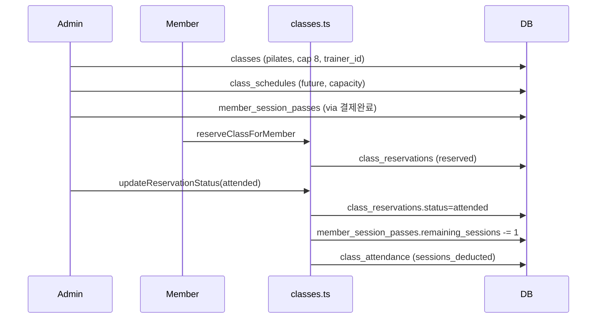

# MotionHub P1 — 그룹수업 E2E 검증 보고서

**검증일:** 2026-06-05  
**대상 센터:** MOVEL (`slug: movel`, Supabase `dcoitajktdaqejnhrnij`)  
**검증 범위:** 코드 경로 분석 + 프로덕션 DB 상태 + motionhub.kr UI 스모크

---

## 최종 결론

### 「필라테스 센터가 실제 운영 가능한가?」

**판정: 조건부 가능 (코드는 연결됨, 베타 운영 데이터·UX는 미완)**

| 구분 | 상태 |
|------|------|
| 핵심 플로우 코드 (생성→예약→출석→차감) | ✅ 구현됨 |
| 프로덕션 MOVEL에서 시나리오 1~7 완주 | ❌ 미실행 |
| 필라테스 전용 결제·회차권 지급 UX | ⚠️ 기본값 OFF, 패키지 미설정 |
| 회원앱 회차 잔여 표시 | ❌ 없음 |
| 대기예약 회원 UI | ❌ 없음 |

**베타 센터가 당장 운영하려면:** 관리자가 일정을 active 클래스에 등록하고, 필라테스 결제 카테고리·요금표를 켠 뒤 결제 완료로 회차권을 지급해야 한다.  
**개발 측 P1 보완:** 회차권 직접 지급 UI, 회원앱 잔여 회차 표시, 대기예약 버튼, 출석 시 회차 없음 경고.

---

## 시나리오 검증 (1~7)

| # | 단계 | 코드 | MOVEL DB (2026-06-05) | 결과 |
|---|------|------|------------------------|------|
| 1 | 필라테스 클래스 생성 (정원 8) | `ClassesPage` → `createClass` | `필라테스` active, capacity=8, pass_type=pilates | ✅ |
| 2 | 회원에게 필라테스 20회권 지급 | `assignSessionPass` via 결제 완료 | **전체 회원 pilates pass 0건** | ❌ |
| 3 | 회원앱 로그인 | `/member?center=movel` → `loginMember` | 로그인 화면 정상, active 회원 다수 존재 | ✅ UI / 미로그인 E2E |
| 4 | 수업 예약 | `MemberClassBookingSection` → `reserveClassForMember` | **active 클래스 일정 0건** (일정은 삭제된 `필라` 클래스에만 1건) | ❌ |
| 5 | 예약 상태 확인 | `class_reservations.status` | 예약 row **0건** | — |
| 6 | 관리자 출석 처리 | `ClassesPage` → `updateReservationStatus(attended)` | 미검증 (예약 없음) | — |
| 7 | `member_session_passes` 차감 | `updateReservationStatus` 내 deduct | 미검증 (패스 없음) | — |

### MOVEL DB 스냅샷 요약

```
center_features: class, pilates, yoga, gx → 모두 enabled (hybrid)
classes:
  - 필라테스 (active, cap 8) — 일정 0
  - 필라 (inactive) — 일정 1 (2026-06-17)
  - 그룹pt (active) — 일정 0
class_reservations: 0
member_session_passes (pilates): 0
reward_settings: payment_category_flags, pilates_pricing → row 없음 (기본값 적용)
```

---

## 확인 항목 매트릭스

| 항목 | 관리자 | 회원앱 | API | 프로덕션 검증 |
|------|--------|--------|-----|----------------|
| **예약** | ✅ ClassesPage 예약 추가 | ✅ 예약 버튼 (정원 여유 시) | `reserveClassForMember` | ⚠️ 일정 없어 미실행 |
| **취소** | ✅ 출석 패널 취소 | ✅ 24h 전까지 | `cancelClassReservation` | ⚠️ 미실행 |
| **대기예약** | ✅ 상태 라벨 표시 | ❌ 마감 시 버튼 없음 | `waitlist` if `waitlist_enabled` | ❌ 기본 waitlist OFF |
| **정원 초과** | 동일 API → 마감/대기 | ❌ 버튼 숨김 (에러 UX 없음) | `정원이 마감되었습니다` | ⚠️ 코드만 확인 |
| **출석** | ✅ 출석 버튼 | — | `updateReservationStatus` + `class_attendance` insert | ⚠️ 미실행 |
| **노쇼** | ✅ 노쇼 버튼 | — | status만 변경, **차감 없음** | ⚠️ 코드만 확인 |
| **취소(예약)** | ✅ | ✅ (24h 규칙) | status=cancelled | ⚠️ 미실행 |

---

## 데이터 흐름 (정상 경로)



**차감 조건 (`src/api/classes.ts`):**

- `classes.deduct_sessions === true` (기본 true)
- `classes.pass_type === 'pilates'` (class_type과 동일 기본)
- `member_session_passes` 에 `pass_type=pilates`, `status=active`, `remaining_sessions > 0`

**예약 시 회차권 검사 없음** — 패스 없어도 예약 가능, 출석 시에만 차감 시도.

---

## 발견 이슈

### P0 — 베타 운영 차단

| # | 원인 | 수정 방법 | 파일 |
|---|------|-----------|------|
| 1 | **active 클래스에 일정 없음** — 일정이 inactive `필라`에만 존재 | 관리자가 `필라테스` 클래스로 +일정 등록 (미래, 14일 이내) | 운영 (ClassesPage) |
| 2 | **필라테스 회차권 0건** — 결제 카테고리·요금표 미설정 | 결제 관리 → 필라테스 ON → 20회 패키지 등록 → 결제요청·계약서명·완료 | `PaymentsPage`, `paymentCategorySettings.ts` |
| 3 | `payment_category_flags` / `pilates_pricing` DB row 없음 → pilates **기본 OFF** | 센터에서 카테고리·요금 저장 | `src/api/paymentCategorySettings.ts`, `src/api/pricing.ts` |

### P1 — 운영 품질

| # | 원인 | 수정 방법 | 파일 |
|---|------|-----------|------|
| 4 | 회원앱에 필라테스 잔여 회차 미표시 | 홈/수업 탭에 `member_session_passes` 조회 UI | 신규 컴포넌트 + API |
| 5 | 회차권 **직접 지급** 관리 UI 없음 | 회원 상세 또는 클래스 관리에「회차권 지급」 | `memberSessionPasses.ts` 활용 |
| 6 | 대기예약 API는 있으나 회원 UI 없음 | 마감+`waitlist_enabled` 시「대기 신청」버튼 | `MemberClassBookingSection.tsx` |
| 7 | `waitlist_enabled` 관리자 UI 없음 (기본 false) | 클래스 등록/수정에 대기예약 토글 | `ClassesPage.tsx` |
| 8 | 출석 시 패스 없음/0회여도 **성공** (`sessions_deducted=0`) | 출석 전 패스 확인 또는 경고 토스트 | `classes.ts`, `ClassesPage.tsx` |
| 9 | 패스 조회에 `center_id` 미필터 | `.eq('center_id', centerId)` 추가 | `classes.ts` `updateReservationStatus` |
| 10 | 패스 update 에러 미처리 | `if (error) throw error` | `classes.ts` |
| 11 | inactive 클래스 일정이 회원앱에 노출 | 일정 조회 시 `classes.status=active` 필터 | `fetchClassSchedulesInRange` |
| 12 | 회원앱 `center_features` 미적용 | class/pilates OFF 시 수업 탭 숨김 | `MemberPortalPage.tsx` |

### P2 — 이미 해결됨

| # | 내용 | 상태 |
|---|------|------|
| — | `trainers(display_name)` 오류 | ✅ `trainers(name)` 수정 배포됨 (`3f66850`) |

---

## 권장 E2E 재실행 체크리스트 (MOVEL)

1. [ ] 센터 설정 — `class`, `pilates` ON (현재 ON)
2. [ ] 결제 관리 — 필라테스 카테고리 ON + 20회 패키지 등록
3. [ ] 클래스 — `필라테스` active, 정원 8, 선생님 지정
4. [ ] 일정 — **내일~14일 이내** 시간 등록 (회원앱 노출 조건)
5. [ ] 테스트 회원 — 결제요청(필라테스 20회) → 회원 계약 서명 → 관리자 결제 완료
6. [ ] 회원앱 — `/member?center=movel` 로그인 → 수업 일정 → 예약
7. [ ] 관리자 — `/admin/classes` → 출석
8. [ ] SQL 확인:
   ```sql
   SELECT remaining_sessions FROM member_session_passes
   WHERE member_id = '<회원ID>' AND pass_type = 'pilates' AND status = 'active';
   SELECT * FROM class_attendance WHERE member_id = '<회원ID>' ORDER BY created_at DESC LIMIT 1;
   ```

---

## 테이블별 역할

| 테이블 | 역할 | E2E에서 확인 |
|--------|------|----------------|
| `classes` | 수업 종류·정원·담당·pass_type | ✅ row 존재 |
| `class_schedules` | 회차별 일시·정원 override | ⚠️ 1건(inactive 클래스) |
| `class_reservations` | 예약/대기/취소/출석/노쇼 | ❌ 0건 |
| `class_attendance` | 출석 기록·차감 회차 수 | ❌ 미생성 |
| `member_session_passes` | 필라테스 등 회차권 | ❌ 0건 |

---

## P1 Sprint 권장 액션

1. **운영:** 위 체크리스트로 MOVEL에서 1회 E2E 수동 완주 + SQL 스크린샷
2. **개발 (당주):** 회차권 직접 지급 UI, 출석 시 패스 검증, inactive 클래스 일정 필터
3. **개발 (다음):** 회원 잔여 회차 표시, 대기예약 UI, `waitlist_enabled` 토글
